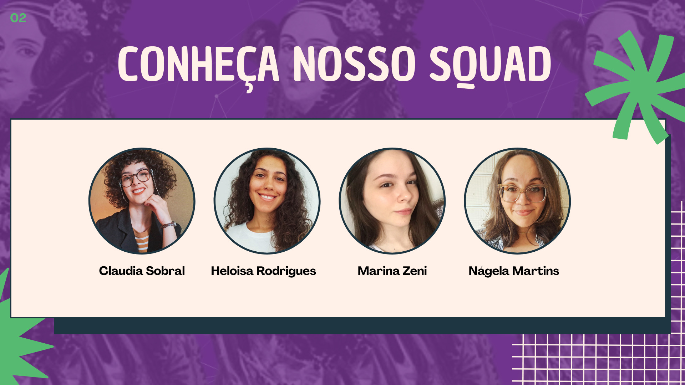
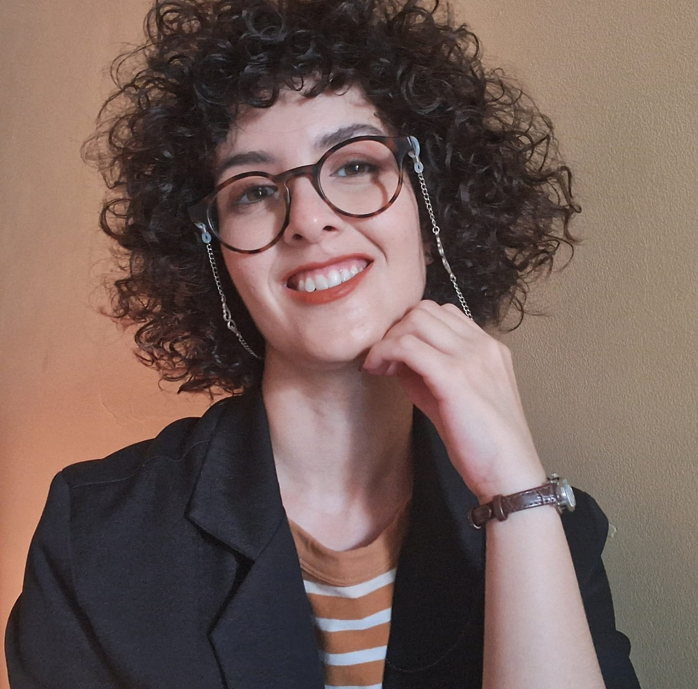
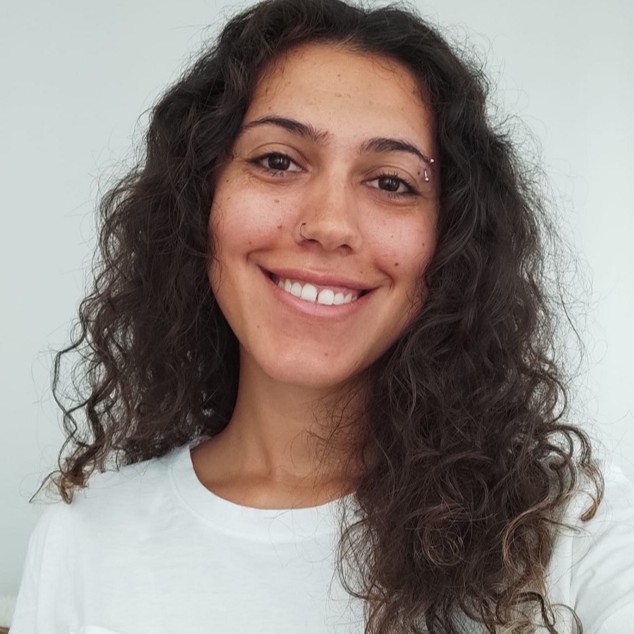
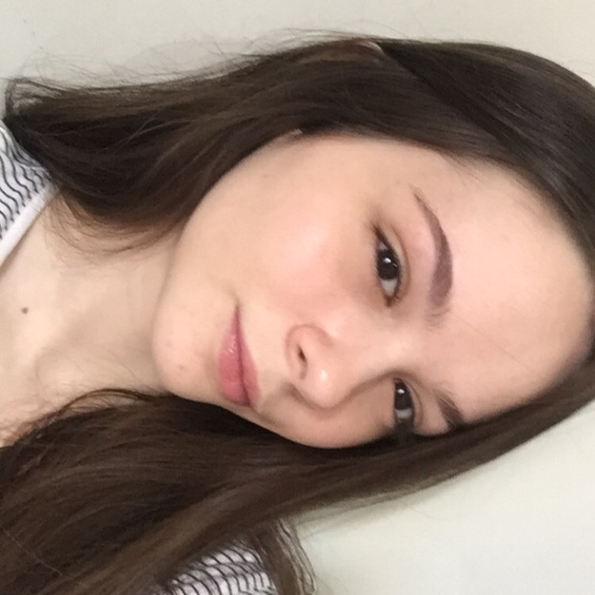
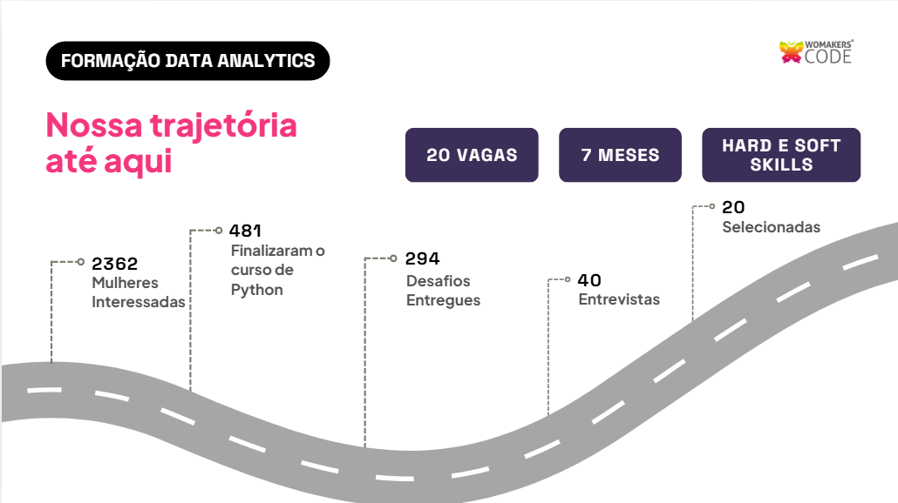
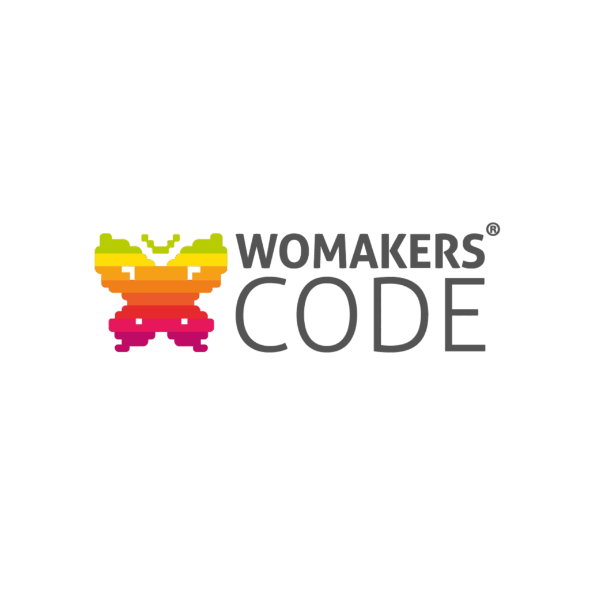

# Squad Ada Lovelace

## 👥 Integrantes do Time

---

<table>

| Foto | Nome | Redes sociais | 
| :---: | :--- | :--- |
|  | **Claudia Sobral** |  |
|  | **Heloisa Sousa Rodrigues** |  |
|  | **Marina Zeni Oliveira Marques Calderan** |  |
|  | **Nagela Martins Souza** |  |

</table>

---

## Bootcamp Data Analytics

Olá! Nós somos a squad Ada Lovelace, cujo nome é inspirado em Augusta Ada Lovelace - ou Condessa de Lovelace - mulher que desenvolveu o primeiro algoritmo a ser executado por uma máquina. Inspiradas por ela, somos parte da turma 10 do [bootcamp de Data Analytics da WoMakersCode](https://www.womakerscode.org/data-analytics), programa que tem por objetivo a formação de mulheres na área de análise de dados, com duração de 7 meses, com mentoria de carreira e conexões com mercado de trabalho.

Para chegar até aqui, fizemos um processo seletivo entre 2362 mulheres, que resultou na seleção de vinte pessoas, das quais somos parte, para participarmos desse programa.

Dentro desse programa, estamos realizando uma formação completa, com teoria e prática, dentro dos variados temas dentro de Data Analytics. Entre eles, alguns são:

  <ul>
    <li>Python para análise de dados;</li>
    <li>Estatística aplicada;</li>
    <li>Modelos regressivos;</li>
    <li>Visualização de dados;</li>
    <li>Business Intelligence;</li>
    <li>Data Storytelling;</li>
    <li>Banco de Dados;</li>
    <li>Computação em nuvem</li>
  </ul>

## Projetos da squad

Durante o programa, trabalhamos em grupo para a realização de desafios práticos de mercado relativos aos temas do curso. Confira:

>**[Desafio Python para dados: numpy e pandas](https://github.com/squad-ada-lovelace/Desafio_01-Python_para_dados)** 

>Primeiro desafio do Bootcamp Data Analytics, cujo objetivo é usar a linguagem Python para analisar uma base de dados sobre a saúde do sono.

>**[Desafio Estatística com Python: frequências e medidas](https://github.com/squad-ada-lovelace/Desafio_02-Frequencias_e_Medidas)** 

>Segundo desafio do Bootcamp Data Analytics, cujo objetivo é explorar nosso conhecimento para realizar a análise estatística de um dataset que contém o catálogo de 2019 de filmes e séries da Netflix.

## 🦋 Por trás da squad: WomakersCode  

A WoMakersCode é a maior comunidade de tecnologia para mulheres da América Latina, focada em impulsionar o protagonismo feminino e a mobilidade social por meio da educação e da empregabilidade. A organização atua capacitando e conectando mulheres (cis e trans) ao mercado de trabalho através de cursos gratuitos, bootcamps, mentorias e parcerias corporativas, apoiando o desenvolvimento de suas carreiras desde o início até cargos de liderança.

🔗 Saiba mais clicando [aqui](https://www.womakerscode.org/)

  Feito com 💜 por nosso Squad!

